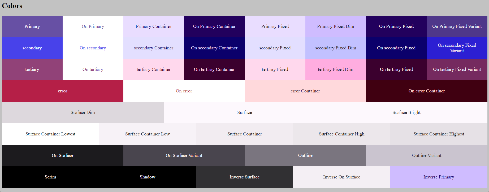

# Material3

A library developed in Sass based on Google's Material Design 3

### Install

```sh
npm install @vp-autox/material3
```

```sh
yarn add @vp-autox/material3
```

```bash
pnpm add @vp-autox/material3
```

```bash
bun add @vp-autox/material3
```

### How to use?

```scss
@use '@vp-autox/material3' as vp-autox;

$theme: (
  primary: '#0f62fe',
);

@include vp-autox.themes($theme);
```

```scss
@use '@vp-autox/material3' as vp-autox;

$theme: (
  primary: '#0F62FE',
  secondary: '#00344B',
  // optional
  tertiary: '#0ADAFE',
  // optional
  neutral: '#939094',
  // optional
  error: '#B3261E',
  // optional
  customColors:
    (
      // optional
      (
          name: 'info',
          value: '#4F616E',
          blend: true,
        ),
    ),
);

@include vp-autox.themes($theme);
```

### Colors

All classes are in the target 'body' by default

<figure><figcaption></figcaption></figure>

<figure><figcaption></figcaption></figure>

```scss
$options: (
  target: '.my-theme',
  isDark: true,
);

@include vp-autox.themes($theme, $options);

body {
  backgroud-color: var(--surface);
  color: var(--on-surface);
}
```
